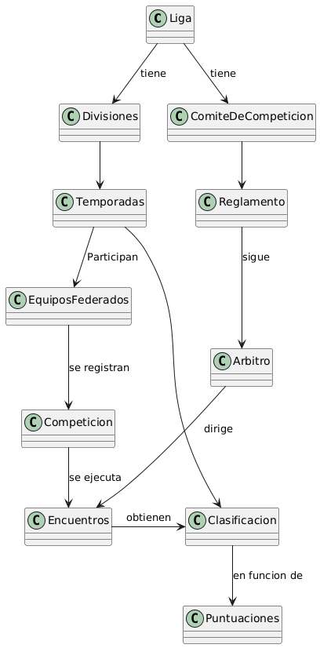
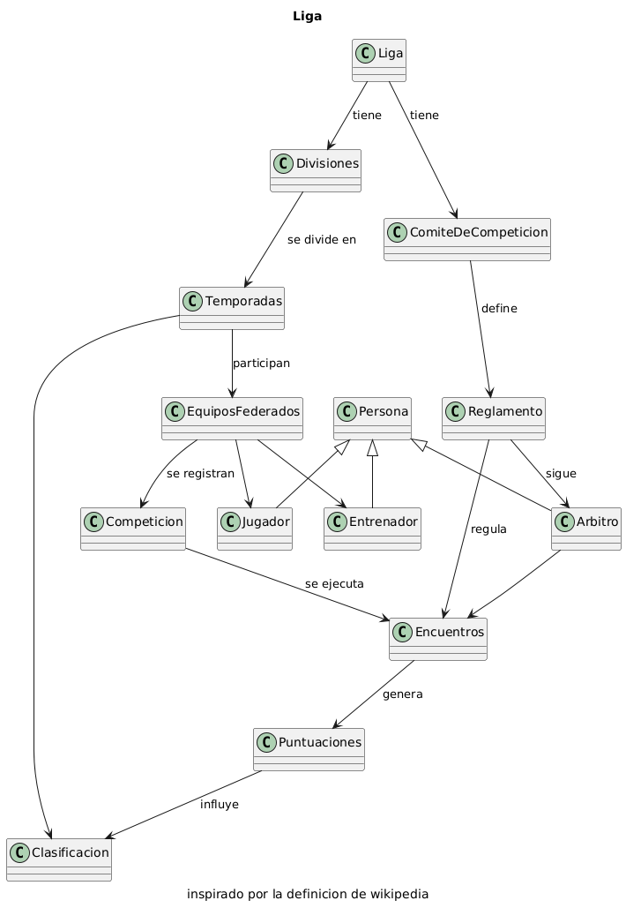

# Ejercicio 001

## Natalia Cruz Babbar

- Modelar la liga de fútbol

Desarrolle una iteración del modelo del dominio visto en clase.

Palabras clave sacadas de la definicion de LIGA de https://es.wikipedia.org/wiki/Sistema_de_ligas_de_fútbol_de_España

1. Divisiones
2. Temporadas
3. Sistema de competicion
    1. Equipos Federados
    2. Desarrollo de la competición
    3. Puntuacion y clasificación
4. Reglamento

## Iteracion 1

```csharp
@startuml

class Liga
class Divisiones
class Temporadas
class Competicion
class EquiposFederados
class Encuentros
class Puntuaciones
class Clasificacion
class Reglamento
class ComiteDeCompeticion
class Arbitro

Liga --> Divisiones: tiene 
Liga -->  ComiteDeCompeticion: tiene

Divisiones --> Temporadas
Temporadas --> EquiposFederados: Participan
Temporadas --> Clasificacion
Clasificacion --> Puntuaciones: en funcion de

EquiposFederados --> Competicion: se registran
Competicion --> Encuentros: se ejecuta

ComiteDeCompeticion --> Reglamento
Reglamento --> Arbitro: sigue

Encuentros -> Clasificacion: obtienen
Arbitro --> Encuentros: dirige

@enduml
```



## iteracion 2
```csharp
@startuml
title Liga
caption inspirado por la definicion de wikipedia

class Liga
class Divisiones
class Temporadas
class Competicion
class EquiposFederados
class Encuentros
class Puntuaciones
class Clasificacion
class Reglamento
class ComiteDeCompeticion
class Arbitro
class Persona
class Jugador
class Entrenador

Liga --> Divisiones: tiene
Liga --> ComiteDeCompeticion: tiene

Divisiones --> Temporadas: se divide en
Temporadas --> EquiposFederados: participan
Temporadas --> Clasificacion

EquiposFederados --> Competicion: se registran
Competicion --> Encuentros: se ejecuta
Encuentros --> Puntuaciones: genera

ComiteDeCompeticion --> Reglamento: define 
Reglamento --> Arbitro: sigue
Reglamento --> Encuentros: regula

EquiposFederados --> Jugador
EquiposFederados --> Entrenador

Persona <|-- Jugador
Persona <|-- Entrenador
Persona <|-- Arbitro

Arbitro --> Encuentros
Puntuaciones --> Clasificacion: influye

@enduml
```

