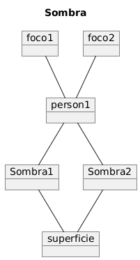
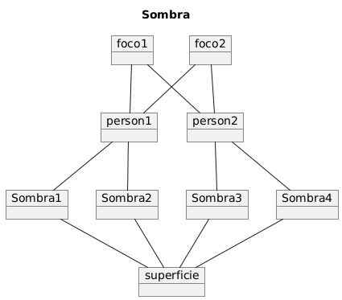

# Ejercicio 002

Modelar utilizando los artefactos que considere pertinentes:

- La sombra

## iteracion 1
```csharp
@startuml

class FuenteDeLuz
class Objeto
class Sombra
class Superficie

FuenteDeLuz -- Objeto
Objeto -- Sombra
Sombra -- Superficie


@enduml
```


```csharp
@startuml
title Sombra

object person1

object foco1
object foco2

object Sombra1
object Sombra2

object superficie

foco1 -- person1
foco2 -- person1

person1 -- Sombra1
person1 -- Sombra2

Sombra2 -- superficie
Sombra1 -- superficie


@enduml

```


## iteracion 2
```csharp
@startuml

class FuenteDeLuz
class Objeto
class Sombra
class Superficie

FuenteDeLuz -- Objeto
Objeto -- Sombra
Sombra -- Superficie


@enduml
```


## iteracion 3
```csharp
@startuml

class FuenteDeLuz
class Objeto
class Sombra
class Superficie


FuenteDeLuz -- Objeto
Objeto -- Sombra
Objeto .. Sombra
Sombra -- Superficie
FuenteDeLuz .. Superficie

@enduml
```


### Diagramas de objetos

- una persona, dos focos 


- dos personas, dos focos


