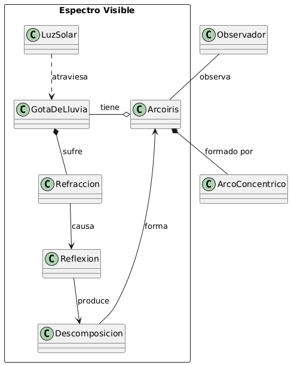
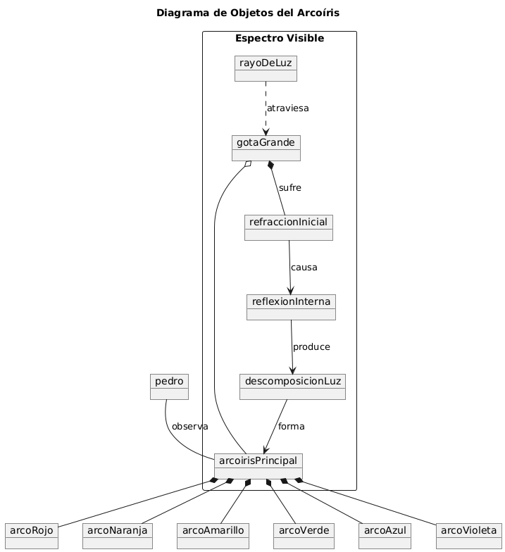

# Ejercicio 003

<details open>
<summary>El Arcoriris</summary>
<br>
Se toma como referencia el siguiente texto:

"Un arcoíris​ o arco iris es un fenómeno óptico y meteorológico que causa la aparición en la atmósfera terrestre de un arco multicolor, a veces, doble, por la descomposición de la luz solar en el espectro visible. Se produce por refracción, cuando la luz atraviesa gotas de agua. Está formado por arcos concéntricos de colores, sin solución de continuidad entre ellos, con el rojo hacia la parte exterior y el violeta hacia el interior. A altitud suficiente, por ejemplo cuando se viaja en avión, el arcoíris se puede observar en forma de círculo completo.

Para los colores vistos por el ojo humano, la secuencia más comúnmente citada y recordada es la de Isaac Newton, definida por siete colores fundamentales: rojo, naranja, amarillo, verde, azul, índigo y violeta. Una lectura cuidadosa del trabajo de Newton indica que el color que llamó azul es lo que actualmente llamaríamos cian."

<details open>
<summary>ITERACION 1</summary>
<br>

### Diagrama de clases
```
@startuml
title Arcoiris

class Arcoiris
class GotaDeAgua
class LuzSolar

Arcoiris --  GotaDeAgua : Se forma con
Arcoiris -- LuzSolar : Causa

@enduml
```


### Diagrama de Objetos
```
@startuml
object Arcoiris
object GotaDeAgua
object LuzSolar 

Arcoiris -- GotaDeAgua : "Se forma con"
Arcoiris -- LuzSolar : "Causa"
@enduml
```


### Diagrama de Estados

```
@startuml
[*] --> LuzSolar

LuzSolar --> GotaDeAgua 
GotaDeAgua : 

GotaDeAgua --> Arcoiris 

Arcoiris --> [*] : Observado por el ojo humano
@enduml
```


</br>
</details>


<details open>
<summary>ITERACION 2</summary>
<br>

### Diagrama de clases
```
@startuml
title Arcoiris
class LuzSolar 
class Refraccion 
class Reflexion 
class Descomposicion
class Observacion 

LuzSolar -->  Refraccion : genera
Refraccion  -->  Reflexion : causa
Reflexion  -->  Descomposicion : produce
Descomposicion  -->  Observacion : se muestra en
@enduml
```


### Diagrama de Objetos
```
@startuml
object LuzSolar
object Refraccion 
object Reflexion
object Descomposicion 
object Observacion 

LuzSolar --> Refraccion : genera
Refraccion --> Reflexion : causa
Reflexion --> Descomposicion : produce
Descomposicion --> Observacion : muestra
@enduml
```


### Diagrama de Estados

```
@startuml
[*] --> LuzSolar
LuzSolar --> Refraccion : genera
Refraccion --> Reflexion : La luz se refleja internamente
Reflexion --> Descomposicion : Se descompone en colores
Descomposicion --> Observacion : Luz es vista por el ojo humano
Observacion --> [*]
@enduml

```


</details>


<details open>
<summary>RETO 1</summary>
<br>

# RETO 1 MEJORAR ITERACIONES
## ARCOIRIS

### Diagrama de Clases

```
@startuml

package "Espectro Visible" <<Rectangle>> {

  class Arcoiris
  class LuzSolar
  class GotaDeLluvia
  class Refraccion 
  class Reflexion 
  class Descomposicion  

  LuzSolar ..> GotaDeLluvia : atraviesa
  GotaDeLluvia *-- Refraccion : sufre
  Refraccion --> Reflexion : causa
  Reflexion --> Descomposicion : produce
  Descomposicion --> Arcoiris : forma
}

class ArcoConcentrico 
Arcoiris *-- ArcoConcentrico : formado por
Arcoiris o- GotaDeLluvia: tiene 
class Observador 

Observador -- Arcoiris : observa

@enduml
```



### Diagrama de Objetos

```
@startuml
title Diagrama de Objetos del Arcoíris

package "Espectro Visible" <<Rectangle>> {

  object arcoirisPrincipal
  object rayoDeLuz 
  object gotaGrande
  object refraccionInicial
  object reflexionInterna
  object descomposicionLuz

  rayoDeLuz ..> gotaGrande : atraviesa
  gotaGrande *-- refraccionInicial : sufre
  refraccionInicial --> reflexionInterna : causa
  reflexionInterna --> descomposicionLuz : produce
  descomposicionLuz --> arcoirisPrincipal : forma
  gotaGrande o- arcoirisPrincipal 

}

object arcoRojo
object arcoNaranja
object arcoAmarillo
object arcoVerde
object arcoAzul
object arcoVioleta

arcoirisPrincipal *-- arcoRojo 
arcoirisPrincipal *-- arcoNaranja 
arcoirisPrincipal *-- arcoAmarillo 
arcoirisPrincipal *-- arcoVerde 
arcoirisPrincipal *-- arcoAzul 
arcoirisPrincipal *-- arcoVioleta 

object pedro
pedro -- arcoirisPrincipal : observa

@enduml

```



### Diagrama de estados

```
@startuml
title Condiciones para la Formación del Arcoíris

[*] --> SinAgua : No hay gotas de agua en la atmósfera
SinAgua --> ConAgua : Comienza la presencia de gotas de agua
ConAgua --> FormacionArcoiris : La luz interactúa con las gotas
FormacionArcoiris --> SinAgua : Gotas desaparecen o la lluvia se detiene
SinAgua --> [*]

@enduml
```


</details>


</details>

---

<details open>
<summary>Ciclo de Vida de un Producto</summary>
<br>

[Articulo de Referencia](https://rockcontent.com/es/blog/ciclo-de-vida-de-un-producto/#:~:text=El%20ciclo%20de%20vida%20de,%2C%20crecimiento%2C%20madurez%20y%20declive)

<details open>
<summary>ITERACION 1</summary>
<br>

## Diagrama De Clases

```
@startuml
class Producto 
class Desarrollo 
class Introduccion
class Crecimiento 
class Madurez 
class Declive
Producto --> Desarrollo : inicia con
Desarrollo --> Introduccion : pasa a
Introduccion --> Crecimiento : evoluciona a
Crecimiento --> Madurez : llega a
Madurez --> Declive : termina en
@enduml
```


## Diagrama De Objetos
```
@startuml
title Blackberry
object Blackberry
object FaseLanzamiento
object FaseCrecimiento
object FaseMadurez
object FaseDeclive
Blackberry --> FaseLanzamiento : Lanza modelos como 5000 y 7100; se enfoca en e-mail.
FaseLanzamiento --> FaseCrecimiento : Expande su presencia a más de 120 países y alta demanda
FaseCrecimiento --> FaseMadurez : "Alcanza 3% de cuota de mercado; ventas máximas.
FaseMadurez --> FaseDeclive : Pierde valor por falta de innovación; competencia intensa
@enduml
```


## Diagrama De Estados
```
@startuml
[*] --> Desarrollo : Inicia el desarrollo
Desarrollo --> Introducción : Lanza el producto
Introducción --> Crecimiento : Aumento en ventas
Crecimiento --> Madurez : Ventas estables
Madurez --> Declive : Comienza a declinar
Declive --> [*] : Fin del ciclo de vida
@enduml
```


</details>


<details open>
<summary>RETO 1</summary>
<br>

## CICLO DE VIDA DE UN PRODCUCTO
Nueva referencia(https://www.zendesk.com.mx/blog/ciclo-de-vida-producto/)

### Diagrama De Clases
```
@startuml
class Producto 
class Desarrollo 
class Introduccion
class Crecimiento 
class Madurez 
class Declive 
class EstrategiaMarketing

Producto *-- Desarrollo
Desarrollo --> Introduccion : lanzamiento al mercado
Introduccion --> Crecimiento : aceptación del consumidor
Crecimiento --> Madurez : saturación de mercado
Madurez --> Declive : caída de ventas
Declive --> Desarrollo : relanzamiento o\nrenovación del producto

Desarrollo o-- EstrategiaMarketing : utiliza
Introduccion o-- EstrategiaMarketing : adapta
Crecimiento o-- EstrategiaMarketing : refuerza
Madurez o-- EstrategiaMarketing : diferencia
Declive o-- EstrategiaMarketing : evalúa

@enduml
```


### Diagrama De Objetos

```
@startuml
title Blackberry

object Blackberry
object Desarrollo
object Introduccion
object Crecimiento
object Madurez
object Declive
object EstrategiaMarketing

Blackberry *-- Desarrollo 
Desarrollo --> Introduccion 
Introduccion --> Crecimiento
Crecimiento --> Madurez 
Madurez --> Declive 
Declive --> Desarrollo

Desarrollo o-- EstrategiaMarketing : utiliza\nfunciones de e-mail
Introduccion o-- EstrategiaMarketing : adapta\ncampañas de lanzamiento
Crecimiento o-- EstrategiaMarketing : refuerza\nexpansión global
Madurez o-- EstrategiaMarketing : diferencia\ncon el teclado físico
Declive o-- EstrategiaMarketing : evalúa\nposibles relanzamientos

@enduml
```


### Diagrama De Estados
```
@startuml
title Fase de Madurez de un Producto

[*] --> Establecimiento
Establecimiento --> Diferenciación : Implementa estrategias de\nmarketing y promociones
Diferenciación --> Fidelización : Desarrolla programas de\nlealtad y calidad de servicio
Fidelización --> Estabilidad : Mantiene la cuota de mercado
Fidelización --> Riesgo : Identifica amenazas de\ncompetencia intensa

Estabilidad --> Riesgo : Puede disminuir\ncuota de mercado
Riesgo --> Reinvención : Evalúa nuevas características\npara revitalizar el producto
Riesgo --> Declive : Si no se implementan cambios\nsustanciales

Reinvención --> Establecimiento : Redefine el producto\ny reinicia el ciclo
Declive --> [*] : Producto fuera del mercado

@enduml
```


</details>


</details>
