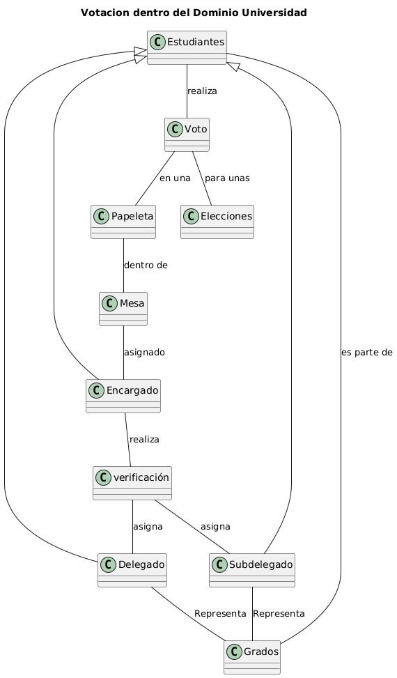
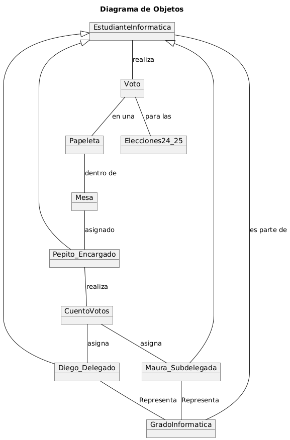
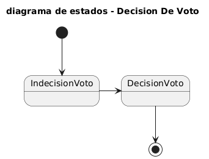
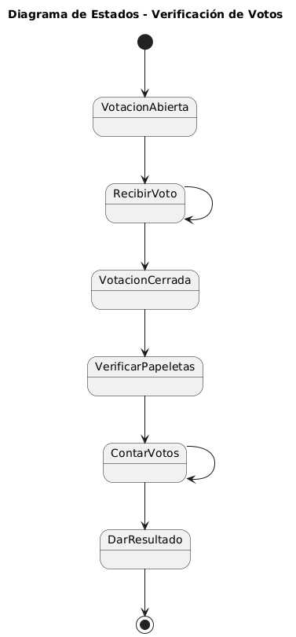

# Modelo del dominio de Sistema de Votacion de delegados en Universidad

### Requisitos / información obtenida / Datos importantes

1. Los estudiantes elegirán un **delegado** y un **subdelegado** que les represente dentro de su **grupo**. Se propondrá como Delegado al estudiante que obtenga la mayoría simple de los **votos** emitidos, y como Subdelegado al segundo más votado.
2. Cada estudiante sólo podrá emitir su voto y ser candidato en el curso o grupo en el que esté matriculado. 
3. Las **elecciones** de delegados se realizaran a través de una votación libre, secreta personal y por escrito. 
4. En cada **papeleta** deberá figurar únicamente un nombre
5. Una vez finalizada la votación, se realizará la **verificación** pública de los votos emitidos.
6. La **mesa** se encarga de recibir las papeletas, con un **encargado** de llevar la mesa.  

## Diagrama de clases
[Codigo plantuml](DiagramaClases.plantuml)

## Diagrama de Objetos
[Codigo plantuml](DiagramaObjetos.plantuml)

## Diagrama de estados
### Diagrama de estados de proceso de decision de voto

[Codigo plantuml](DiagramaEstados1.plantuml)

### Diagraa de estados de proceso de Contrar votos

[Codigo plantuml](DiagramaEstados2.plantuml)

