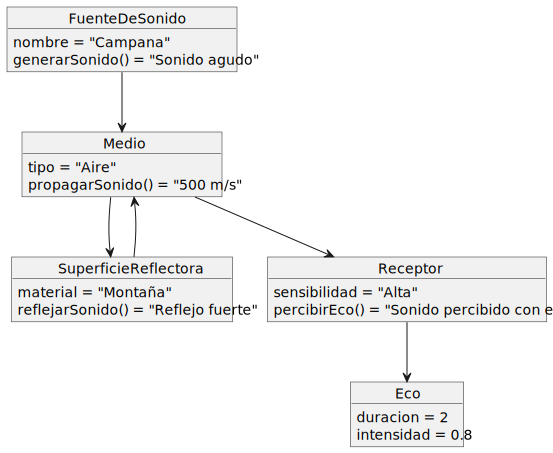
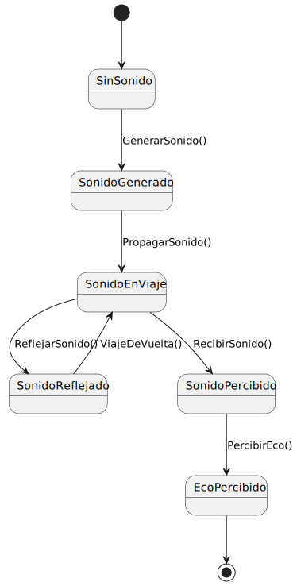

# El Eco

## Descripción
El eco es un fenómeno consistente en escuchar un sonido después de haberse extinguido la sensación producida por la onda sonora. Se produce eco cuando la onda sonora se refleja perpendicularmente en una superficie.

## Diagrama de Clases

### Conceptos clave:
- **Fuente de Sonido**: Genera el sonido que causa el eco.
- **Medio**: Es el espacio (aire, agua, etc.) a través del cual viaja el sonido.
- **Superficie Reflectora**: Es la barrera que refleja el sonido, creando el eco.
- **Receptor**: El receptor que percibe tanto el sonido original como el eco.
- **Eco**: El fenómeno que ocurre cuando el sonido rebota y llega de nuevo al receptor.

## Diagrama de Objetos

## Diagrama de Estados

