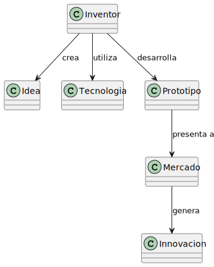
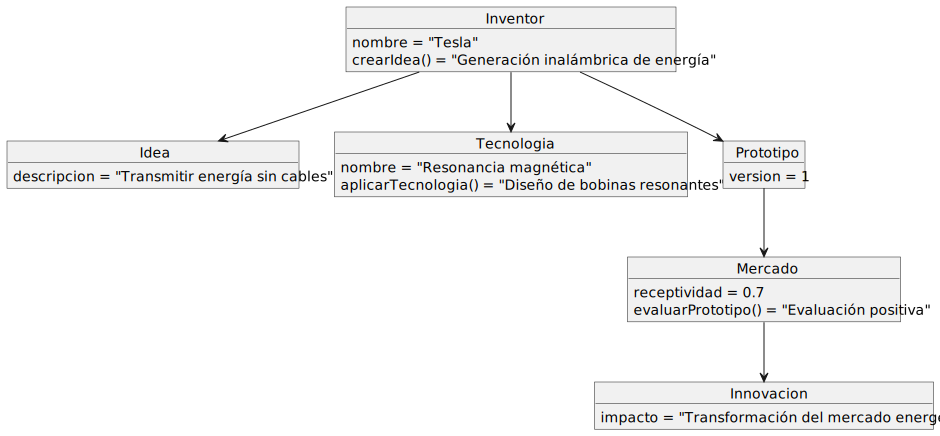
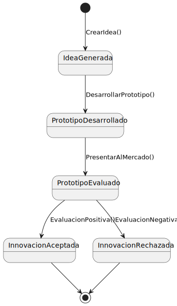

# La Innovación

## Descripción
La innovación, como proceso por el que se transforma una idea en un producto o servicio novedoso en el mercado, o por el que se incorpora un novedoso proceso de fabricación o nuevos métodos de organización o de comercialización en la empresa

## Diagrama de Clases
### Conceptos clave:

- **Inventor**: Persona o entidad que realiza innovaciones.
- **Idea**: Es el concepto que se busca materializar.
- **Tecnología**: Conjunto de herramientas y conocimientos usados para desarrollar la idea.
- **Prototipo**: Primer desarrollo o versión de la innovación.
- **Mercado**: El lugar o conjunto de personas a quienes se les ofrece la innovación.
- **Innovación**: El producto o cambio nuevo que se introduce.

## Diagrama de Objetos

## Diagrama de Estados

