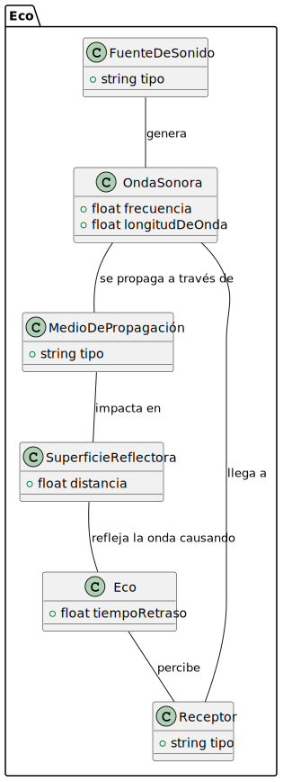

# Reto - 001

# El Eco

## Descripción
El eco es un fenómeno consistente en escuchar un sonido después de haberse extinguido la sensación producida por la onda sonora. Se produce eco cuando la onda sonora se refleja perpendicularmente en una superficie.

## Diagrama de Clases
### Conceptos clave:
- **Fuente de Sonido**: Genera el sonido que causa el eco.
- **Onda Sonora**: Es la onda que se propaga en el medio.
- **Medio**: Es el espacio (aire, agua, etc.) a través del cual viaja el sonido.
- **Superficie Reflectora**: Es la barrera que refleja el sonido, creando el eco.
- **Receptor**: El receptor que percibe tanto el sonido original como el eco.

|  |  |
| ----------- | ----------- |
|  |  |

## Diagrama de Objetos

## Diagrama de Estados

# La Innovación

## Descripción
La innovación, como proceso por el que se transforma una idea en un producto o servicio novedoso en el mercado, o por el que se incorpora un novedoso proceso de fabricación o nuevos métodos de organización o de comercialización en la empresa

## Diagrama de Clases
### Conceptos clave:

- **Inventor**: Persona o entidad que realiza innovaciones.
- **Idea**: Es el concepto que se busca materializar.
- **Tecnología**: Conjunto de herramientas y conocimientos usados para desarrollar la idea.
- **Prototipo**: Primer desarrollo o versión de la innovación.
- **Mercado**: El lugar o conjunto de personas a quienes se les ofrece la innovación.
- **Innovación**: El producto o cambio nuevo que se introduce.

## Diagrama de Objetos

## Diagrama de Estados

Nota sobre las Mejoras en los Diagramas

>## Tema: El Eco
>
>### Diagrama de Clases
>- **Organización**: Agrupé las clases en un paquete llamado `Eco`, lo que hace todo más claro.
>- **Relaciones**: Ahora se ven mejor las conexiones entre las clases y cómo representan el fenómeno del eco.
>- **Clarificación**: Mejoré la forma en que entendemos la interacción de cada clase en el proceso del eco.
>
>### Diagrama de Objetos
>- **Instancias**: Mostré ejemplos concretos de las clases involucradas en el eco.
>- **Interacciones**: Ahora es más fácil ver cómo los objetos se relacionan y cómo se generan y reflejan las ondas sonoras.
>
>### Diagrama de Estados
>- **Estructura**: Organicé el flujo del eco en estados, mostrando cómo se genera y refleja el sonido.
>- **Transiciones**: Aclaré cómo cambian los estados y cómo las ondas sonoras interactúan con el medio y las superficies.
>
>---
>
>## Tema: La Innovación
>
>### Diagrama de Clases
>- **Paquete**: Agrupé las clases en un paquete llamado `Innovacion` para que sea más claro.
>- **Relaciones**: Reorganicé las conexiones entre las clases para reflejar mejor el proceso desde la idea hasta la innovación.
>- **Sin Atributos**: Quité atributos y métodos para enfocarme en las relaciones entre clases.
>
>### Diagrama de Objetos
>- **Instancias**: Mostré ejemplos de cómo un inventor interactúa con ideas, tecnología, prototipos y el mercado.
>- **Relaciones**: Hice más claro cómo se conectan los objetos y el proceso de innovación.
>
>### Diagrama de Estados
>- **Estructura**: Organicé el proceso de innovación en estados, desde la idea hasta la evaluación y aceptación.
>- **Transiciones**: Detallé las transiciones entre estados para mostrar cómo se evalúa y lanza la innovación.
>
>---
>
>## Mejoras Futuras
>Este modelo del dominio de los temas de "El eco" y "La innovación" puede seguir mejorándose y ajustándose según el contexto en el que se quiera aplicar. Existen muchas variables y situaciones que pueden enriquecer el modelo, y siempre hay espacio para incorporar nuevos conceptos o detalles que lo hagan más robusto y relevante. Adaptar estos diagramas a diferentes escenarios podría llevar a una comprensión más profunda y a soluciones más efectivas.

