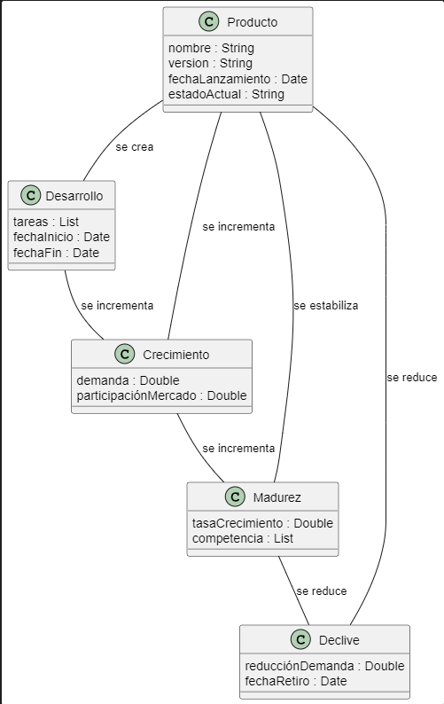
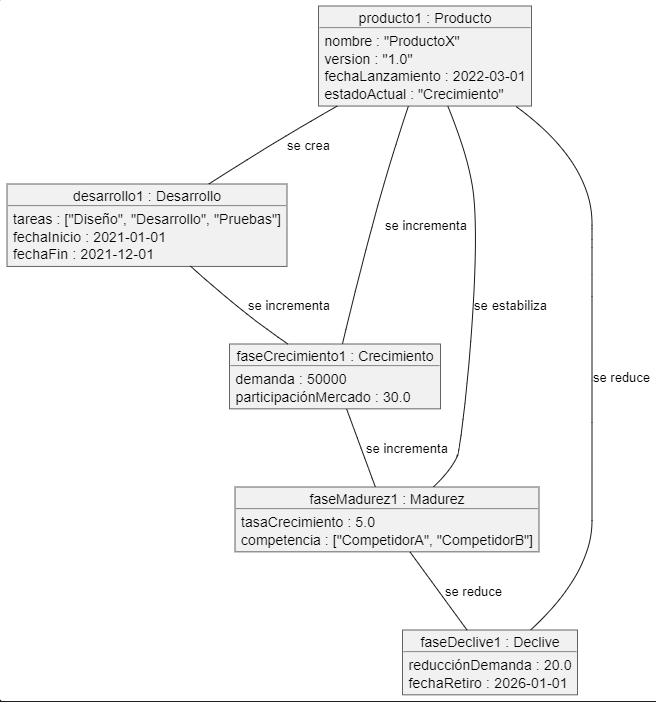
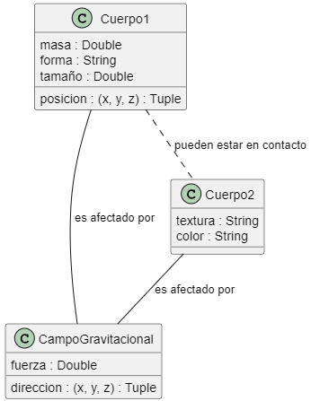
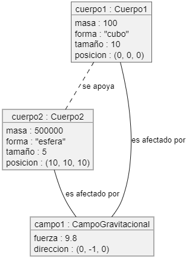

# Ciclo de Vida de un Producto

## Descripción del Proyecto

El ciclo de vida de un producto incluye las siguientes fases principales:
1. **Desarrollo**: El producto es creado y las tareas para su desarrollo son planificadas.
2. **Crecimiento**: El producto aumenta su demanda y participación en el mercado.
3. **Madurez**: La tasa de crecimiento del producto se estabiliza mientras enfrenta competencia.
4. **Declive**: La demanda disminuye y el producto eventualmente es retirado del mercado.

### Diagramas

El diagrama de clases muestra las entidades y relaciones principales que modelan el ciclo de vida de un producto.

El diagrama de objetos muestra cómo se relacionan los objetos en el ciclo de vida de un producto y cómo interactúan entre sí.

Diagrama de Clases:

Diagrama de Objetos:

# Modelado de la Gravedad

## Descripción del Proyecto

El modelo de gravedad describe la fuerza de atracción entre dos objetos masivos. La fuerza de gravedad entre dos objetos depende de la masa de los objetos y la distancia entre ellos.

### Diagramas

El diagrama de clases muestra las entidades principales involucradas en el sistema gravitacional y las relaciones entre ellas.

El diagrama de objetos muestra cómo se relacionan los objetos en el sistema gravitacional y cómo interactúan entre sí.

Diagrama de Clases:

Diagrama de Objetos:

