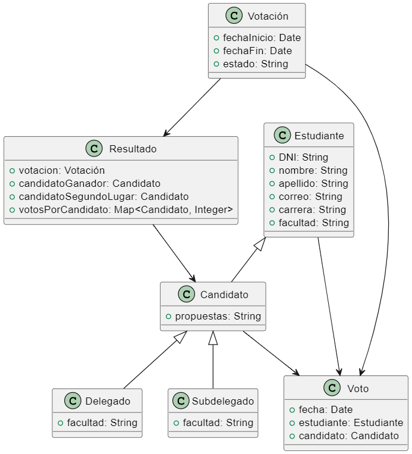
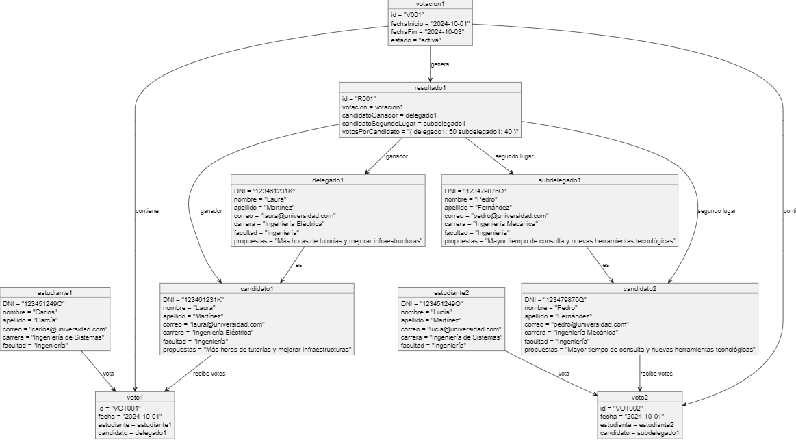
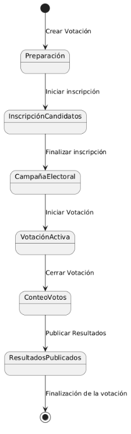

# Sistema de Votación de Delegados Universitarios

Este ejercicio representa un modelo de dominio para la elección de delegados y subdelegados en una universidad.

## Descripción del Modelo

El modelo se compone de varias clases principales, entidades y el flujo del proceso de votación. A continuación, se describen las clases principales y los estados del sistema:

### Clases Principales

#### 1. **Estudiante**

#### 2. **Candidato** (Hereda de Estudiante)

#### 3. **Delegado** (Hereda de Candidato)

#### 4. **Subdelegado** (Hereda de Candidato)

#### 5. **Votación**

#### 6. **Voto**

#### 7. **Resultado**

### Diagrama de Clases

El siguiente es el diagrama UML de clases del sistema:

### Diagrama de Objetos

El siguiente es el diagrama UML de objetos del sistema:

### Estados del Sistema

El sistema de votación de delegados universitarios sigue un proceso de votación con los siguientes estados:

