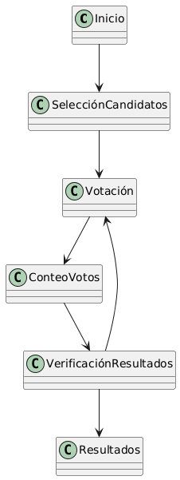
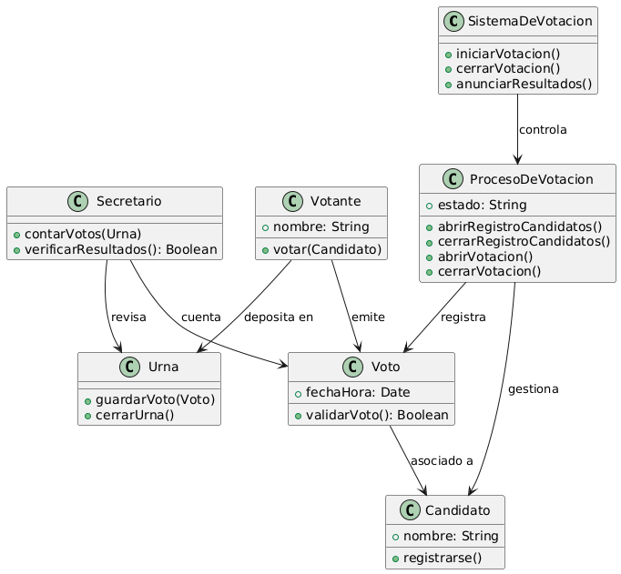

# Enunciado:
Realiza el Modelado de la votación de delegado de clase
## Introducción
El proceso de votación del delegado de clases, realizado hoy mismo en clase
## Diagrama de estados

- Selección de candidatos:
los compañeros dispuestos a ser delegados dan un paso al frente
- Votación:
los demás compañeros introducen sus votos en la urna que luego es usada para el conteo de los votos
- Conteo de votos:
realizado por el secretario (estudiante que no aportó su voto), se cuentan los votos en la urna para buscar los resultados
- Revisión de los resultados:
si los resultados son correctos y no habido ninguna infracción se pasa a anunciar los resultados, sino se repite la votación
- Resultados
Anuncio de los resultados
## Diagrama de clases

