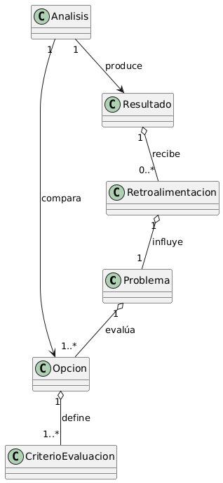
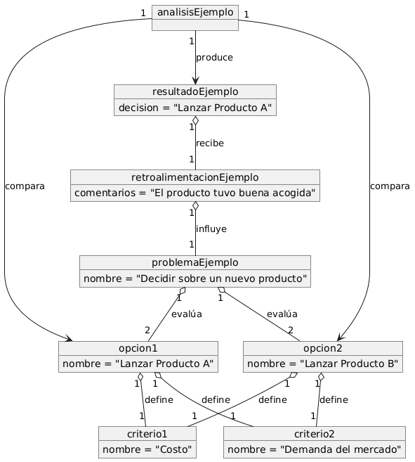

# Toma de Decisiones

## Descripción General

La **toma de decisiones** es un proceso fundamental en la gestión y resolución de problemas en diversos contextos, desde entornos empresariales hasta decisiones cotidianas. Este proceso implica identificar un problema, evaluar opciones disponibles, aplicar criterios de evaluación, realizar un análisis, y finalmente, tomar una decisión que será influenciada por la retroalimentación obtenida.

## Diagrama de Clases

## Diagrama de Objetos

