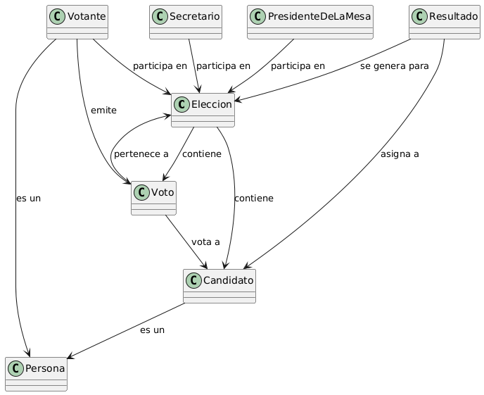

# Glosario de Términos - Elección de Delegado

### Elección
Es el proceso en el cual un grupo de personas (votantes) elige entre varios candidatos a quien será su delegado o representante. La elección puede contener múltiples candidatos y recolectar varios votos.

### Candidato
Persona que participa en una elección con el objetivo de ser seleccionada como delegado. Cada elección puede tener varios candidatos, y cada uno pertenece a la clase *Persona*.

### Persona
Entidad general que representa a cualquier individuo involucrado en el proceso. Puede ser tanto un votante como un candidato.

### Votante
Persona que participa en una elección emitiendo un voto para uno de los candidatos. Cada votante tiene derecho a emitir un voto y forma parte del proceso electoral.

### Voto
Es la acción de elegir a un candidato en una elección. Un voto es emitido por un votante y está destinado a un candidato en particular. Cada elección contiene múltiples votos.

### Resultado
Es el conteo final que se genera para determinar el ganador o los ganadores de una elección. Este resultado asigna los votos obtenidos por cada candidato y permite conocer quién ha sido elegido como delegado.

### Secretario
Es la persona encargada de recoger los votos y llevar a cabo el conteo.

### Presidente
Es la persona que se encarga de dirigir la elección y de que se respeten las normas de la votación
