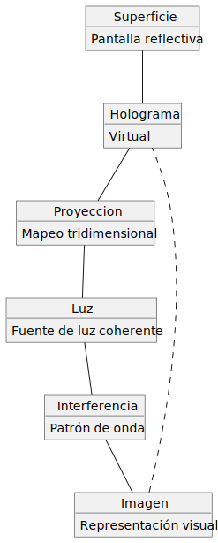

# Modelos del Dominio: Holograma y Motivación

---

## Modelo del Dominio: Holograma

### Descripción
Un holograma es una representación visual tridimensional generada mediante la interferencia de luz en una superficie. Este modelo incluye entidades como la luz coherente, la proyección tridimensional, y la superficie reflectiva que permiten visualizar la imagen.

### Diagrama de Clases

### Entidades del Modelo

- **Holograma**: Representa el fenómeno de proyección tridimensional visual.

- **Proyección**: Define el mapeo tridimensional de la luz para crear el holograma.

- **Luz**: Fuente de luz coherente que interactúa con la superficie y la proyección para generar la interferencia.

- **Interferencia**: Patrón de ondas generado por la interacción de la luz y forma la imagen.

- **Superficie**: Pantalla reflectiva donde se proyecta el holograma.

- **Imagen**: Representación visual generada a resultado de la interferencia.

### Diagrama de Objetos

---

## Modelo del Dominio: Motivación

### Descripción
La motivación es el proceso psicológico detrás de la acción orientada a objetivos, que impulsa a un individuo a perseguir metas, enfrentando obstáculos y buscando una recompensa como resultado de sus acciones.

### Diagrama de Clases

### Entidades del Modelo

- **Motivación**: Impulso interno que mueve a la persona para realizar una acción y alcanzar la meta.

- **Meta**: Objetivo final que el individuo busca alcanzar.

- **Acción**: Esfuerzo que la persona realiza para alcanzar su meta.

- **Obstáculo**: Elementos que dificultan lograr completar la acción.

- **Recompensa**: Beneficio obtenido por haber logrado alcanzar la meta.

### Diagrama de Objetos

